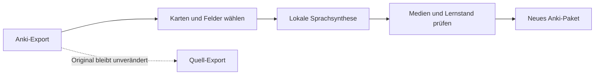

  

# Anki SOUND

**Klare, lokal erzeugte Sprache für ausgewählte Anki-Karten. Das Original bleibt unverändert.**

[Download für macOS](https://github.com/popovantondev/AnkiSound/releases/latest) · [Deutsch](README.de.md) · [Russisch](README.ru.md) · [Englisch](README.md)

**Apple Silicon · macOS 13+ · Version 3.4.11**

Anki SOUND ist eine native macOS-Anwendung. Sie liest einen Anki-Export im Format `.apkg`, erzeugt Sprache lokal und erstellt ein separates, geprüftes Paket. Sie können Karten mit vorhandenen Audios, Karten mit sprachspezifischen Tags oder einen ausgewählten Stapel verarbeiten.

## So funktioniert es

Die Sprachausgabe unterstützt Deutsch, Französisch, Englisch, Spanisch und Russisch. Standardstimmen: DE M5, FR M1, EN M1, ES M1 und RU Kseniya. Die Oberfläche gibt es auf Deutsch, Englisch und Russisch; Deutsch ist voreingestellt. Stimmen werden je Sprache gespeichert. Vor dem Start lassen sich ausgewählte Karten probehören.

## Download und Installation

Laden Sie das macOS-Paket aus den [GitHub-Releases](https://github.com/popovantondev/AnkiSound/releases/latest) herunter. Entpacken Sie den vollständigen Ordner an einen beschreibbaren Ort. Anwendung und Ordner müssen zusammenbleiben.

1. Starten Sie `SETUP.command`. Dafür benötigen Sie Python 3.9–3.12 und eine Internetverbindung, um festgelegte Pakete zu installieren und Stimmenmodelle herunterzuladen.
2. Öffnen Sie Anki SOUND mit `OPEN.command`.
3. Exportieren Sie in Anki einen Stapel als `.apkg`, wählen Sie den Modus, hören Sie die Vorschau an und starten Sie die Verarbeitung.

Die Anwendung ist ad-hoc signiert und nicht von Apple notarisiert. macOS kann den ersten Start blockieren. Prüfen Sie Paket und Prüfsumme und folgen Sie dann der Anleitung zur einzelnen App in der [Benutzeranleitung](https://popovantondev.github.io/AnkiSound/Guide-de.html). Deaktivieren Sie Gatekeeper nicht global.

## Auswahlarten

- **Vorhandene Audios:** Fügen Sie Audio zunächst in Anki auf Ihre bevorzugte Weise hinzu. Anki SOUND ersetzt nur vorhandene `[sound:…]`-Verweise.
- **Sprach-Tags:** Wählen Sie Feld und Tags je Sprache. Tags werden exakt geprüft und funktionieren auch bei eigenen Stapelnamen; mehrdeutige Sprach-Tags werden übersprungen.
- **Ausgewählter Stapel:** Legen Sie Stapel, Feld und Sprechsprache ausdrücklich fest.

Französische Karten verwenden `FR` auf der Vorderseite und `DE` auf der Rückseite. Die übrigen Sprachen verwenden `Front`. Bis zu zwei Karten aus der aktuellen Auswahl lassen sich probehören. Beim Schließen des Fensters oder Ändern der Auswahl stoppt die Vorschau.

## Daten und Grenzen

- Der Eingabe-Export und das installierte Anki-Profil werden nicht verändert. Die Anwendung erstellt einen separaten Export und prüft Medien sowie Lernstand.
- Die Sprachsynthese läuft lokal. Laufzeitpakete und Stimmenmodelle werden bei der Einrichtung heruntergeladen und sind nicht im Repository oder Release-Paket enthalten.
- Lokale Auftragsdaten speichern den genauen Synthesetext, Stimmeinstellungen, Längen und Prüfsummen. Behandeln Sie Auftragsordner und Protokolle als vertraulich; siehe [Sprachqualität und Diagnose](docs/AUDIO_QA.md).
- Für russische Modellgewichte gelten separate **CC BY-NC 4.0**-Bedingungen. Sie werden separat heruntergeladen. Details stehen unter [Drittkomponenten und Modellbedingungen](THIRD_PARTY.md).
- Bei gemischten Sprachen, Abkürzungen und ungewöhnlichen Zeichen kann die Aussprache abweichen. Hören Sie die Vorschau an und prüfen Sie übersprungene Karten.

## Dokumentation

- [Deutsche Anleitung](https://popovantondev.github.io/AnkiSound/Guide-de.html)
- [Englische Anleitung](https://popovantondev.github.io/AnkiSound/Guide-en.html)
- [Russische Anleitung](https://popovantondev.github.io/AnkiSound/Guide-ru.html)
- [Änderungen](CHANGELOG.md)
- [Drittkomponenten und Modellbedingungen](THIRD_PARTY.md)
- [Mitwirken](CONTRIBUTING.de.md) · [Sicherheitsrichtlinie](SECURITY.de.md) · [Lizenz](LICENSE.de.md)

## Build und Tests

Die lokalen Prüfungen stehen in [Mitwirken](CONTRIBUTING.de.md). Für die native macOS-App benötigen Sie Xcode Command Line Tools. Python-Pakete und Stimmenmodelle werden separat installiert.

## Quellcode und Nutzungsrechte

Der Quellcode wird als Portfolio zur Ansicht veröffentlicht. Es wird keine Erlaubnis erteilt, ihn zu verwenden, auszuführen, zu kopieren, zu ändern oder weiterzuverbreiten. Siehe [Lizenz](LICENSE.de.md). Für Drittanbieter-Software und Stimmenmodelle gelten eigene Bedingungen.
