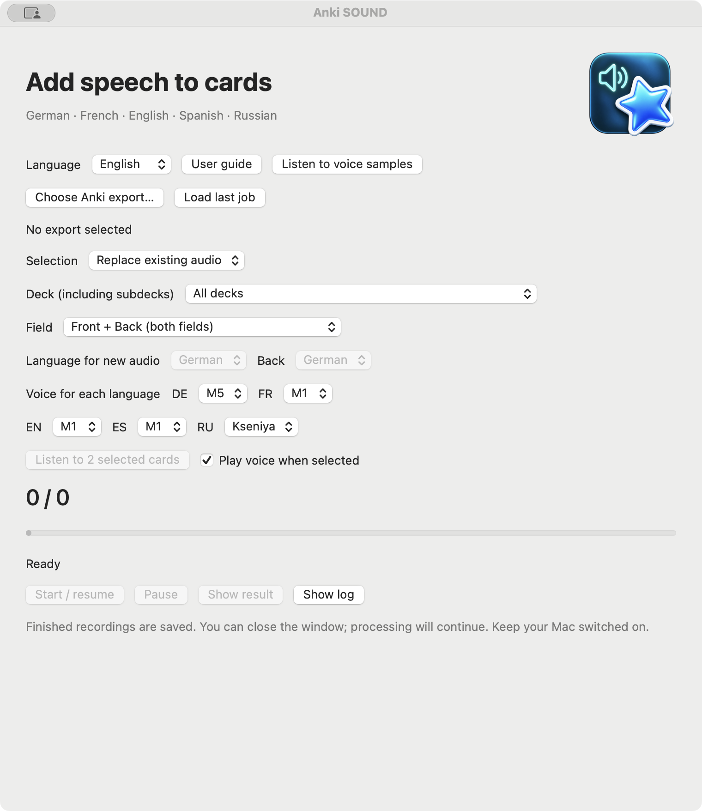
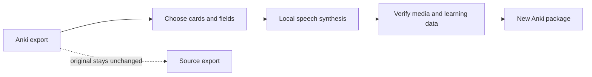

  

# Anki SOUND

**Add clear, local speech to selected Anki cards. Keep your original collection unchanged.**

[Download for macOS](https://github.com/popovantondev/AnkiSound/releases/latest) · [German](README.de.md) · [Russian](README.ru.md) · [English](README.md)

**Apple Silicon · macOS 13+ · Version 3.4.11**

*English interface · Clean start with no export selected.*

Anki SOUND is a native macOS app that reads an Anki `.apkg` export, generates speech locally, and creates a separate verified package. Choose cards that already contain audio, cards with language-specific tags, or cards in a selected deck.

## How it works

The app supports German, French, English, Spanish and Russian speech. Default voices are DE M5, FR M1, EN M1, ES M1 and RU Kseniya. The interface is available in German, English and Russian, with German selected by default. Voice choices are saved per language; selected cards can be previewed before processing.

## Download and install

Download the macOS package from [GitHub Releases](https://github.com/popovantondev/AnkiSound/releases/latest), extract the complete folder to a writable location, and keep the app together with that folder.

1. Run `SETUP.command`. Setup needs Python 3.9–3.12 and an internet connection to install pinned dependencies and download voice models.
2. Run `OPEN.command` to launch Anki SOUND.
3. Export a deck from Anki as `.apkg`, choose a selection mode, listen to the preview, and start when ready.

The app is ad-hoc signed and not notarized by Apple. macOS may block the first launch. Review the package and checksum, then follow the per-app instructions in [the user guide](https://popovantondev.github.io/AnkiSound/Guide-en.html). Do not disable Gatekeeper globally.

## Selection modes

- **Existing audio:** add audio in Anki using your preferred method; Anki SOUND replaces only existing `[sound:…]` references.
- **Language tags:** configure one exact tag for each language. For recognized deck roots, the deck and field determine the language and the matching tag is required. In an unrecognized deck, one unambiguous tag can infer the language for `Front` only; multiple matching language tags are skipped.
- **Selected deck:** select the deck, field and speech language explicitly.

Recognized French decks map `FR` to the front and `DE` to the back. For example, `fr-audio` selects French `Front`, while `de-audio` selects German `Back`. For an unrecognized deck, `custom-de` on `Front` can select German; `custom-de` plus `custom-en` is ambiguous and skipped. An unrecognized `Back` does not infer a language; use Selected deck to choose explicitly. Untagged cards are skipped and tag matching uses exact tokens. The app can preview up to two currently selected cards and stops that preview when the window closes or the selection changes.

## Data and limitations

- The input `.apkg` and installed Anki profile are not modified. The app writes a separate output package and verifies its media and learning data.
- Speech synthesis runs locally. Setup downloads the pinned runtime dependencies and voice models; they are not bundled in the repository or release package.
- Local job metadata stores the exact text sent to synthesis, voice settings, lengths and checksums. Treat job folders and logs as private; see [speech quality and diagnostics](docs/AUDIO_QA.en.md).
- Russian voice weights have their own **CC BY-NC 4.0** terms and are downloaded separately. See [third-party components and model terms](THIRD_PARTY.en.md).
- Speech quality can vary for mixed-language text, abbreviations and unusual symbols. Preview the result and review skipped cards before importing.

## Documentation

- [English user guide](https://popovantondev.github.io/AnkiSound/Guide-en.html)
- [German user guide](https://popovantondev.github.io/AnkiSound/Guide-de.html)
- [Russian user guide](https://popovantondev.github.io/AnkiSound/Guide-ru.html)
- [Change history](CHANGELOG.en.md)
- [Third-party components and model terms](THIRD_PARTY.en.md)
- [Contributing](CONTRIBUTING.md) · [Security policy](SECURITY.md) · [License](LICENSE)

## Build and test

See [CONTRIBUTING.md](CONTRIBUTING.md) for local checks. The native macOS app requires Xcode Command Line Tools; Python dependencies and models are installed separately.

## Source code rights

The source code is published for viewing as a portfolio. No permission is granted to use, run, copy, modify, or redistribute it. See [LICENSE](LICENSE). Third-party software and voice models have separate terms.
