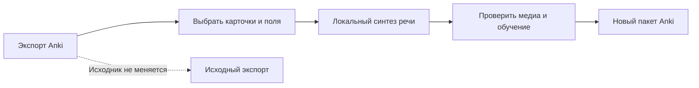

  

# Anki SOUND

**Разборчивая локальная озвучка выбранных карточек Anki. Исходная коллекция остаётся нетронутой.**

[Скачать для macOS](https://github.com/popovantondev/AnkiSound/releases/latest) · [Немецкий](README.de.md) · [Русский](README.ru.md) · [Английский](README.md)

**Apple Silicon · macOS 13+ · Версия 3.4.11**

Anki SOUND — нативная программа для macOS. Она читает экспорт Anki `.apkg`, создаёт озвучку локально и формирует отдельный проверенный пакет. Можно выбрать карточки с уже добавленным звуком, карточки с языковыми тегами или конкретную колоду.

## Как это работает

Поддерживаются немецкая, французская, английская, испанская и русская озвучки. Голоса по умолчанию: DE M5, FR M1, EN M1, ES M1 и RU Kseniya. Интерфейс доступен на немецком, английском и русском языках; по умолчанию выбран немецкий. Голос запоминается отдельно для каждого языка. Перед обработкой можно прослушать выбранные карточки.

## Скачать и установить

Скачайте пакет macOS на странице [GitHub Releases](https://github.com/popovantondev/AnkiSound/releases/latest) и распакуйте всю папку в место, доступное для записи. Приложение должно оставаться рядом с этой папкой.

1. Запустите `SETUP.command`. Для установки закреплённых зависимостей и моделей голосов нужны Python 3.9–3.12 и интернет.
2. Откройте Anki SOUND командой `OPEN.command`.
3. Экспортируйте колоду из Anki в `.apkg`, выберите режим озвучки, прослушайте фрагмент и запустите обработку.

Приложение подписано локальной подписью, но не нотарифицировано Apple. При первом запуске macOS может его заблокировать. Проверьте источник и контрольную сумму пакета, затем следуйте инструкции для отдельного приложения в [руководстве](https://popovantondev.github.io/AnkiSound/Guide-ru.html). Не отключайте Gatekeeper глобально.

## Режимы отбора

- **Заменить существующий звук:** сначала добавьте аудио в Anki любым удобным способом. Anki SOUND заменяет только существующие ссылки `[sound:…]`.
- **Карточки с тегом:** задайте отдельный точный тег для каждого языка. Для распознанных названий колод язык задают колода и поле; нужен соответствующий тег. В неизвестной колоде ровно один однозначный тег может определить язык только для `Front`. Несколько совпавших языковых тегов неоднозначны, такая карточка пропускается.
- **Выбранная колода:** явно задайте колоду, поле и язык озвучки.

В распознанных французских колодах `FR` соответствует `Front`, а `DE` — `Back`. Например, `fr-audio` выбирает французский `Front`, а `de-audio` — немецкий `Back`. В неизвестной колоде тег `custom-de` может определить немецкий язык для `Front`; сочетание `custom-de` и `custom-en` неоднозначно и пропускается. Для `Back` неизвестной колоды язык не определяется — выберите режим «Выбранная колода» и задайте язык явно. Карточки без тега пропускаются, тег сравнивается как точное слово. Можно прослушать до двух карточек из текущего отбора. При закрытии окна или изменении отбора предпрослушивание останавливается.

## Данные и ограничения

- Исходный `.apkg` и установленный профиль Anki не меняются. Программа создаёт отдельный экспорт и проверяет медиа и данные обучения.
- Синтез речи работает локально. При установке скачиваются закреплённые зависимости и модели голосов; они не входят в репозиторий или пакет релиза.
- Локальные данные задания хранят точный текст синтеза, голос, настройки, длительность и контрольные суммы. Считайте папки заданий и журналы личными; подробности — в разделе [«Качество и диагностика озвучки»](docs/AUDIO_QA.ru.md).
- Для весов русской модели действуют отдельные условия **CC BY-NC 4.0**. Они скачиваются отдельно. Подробности: [сторонние компоненты и лицензии моделей](THIRD_PARTY.ru.md).
- Произношение смешанного текста, сокращений и необычных символов может отличаться от ожидаемого. Прослушайте результат и проверьте пропущенные карточки.

## Документация

- [Русская инструкция](https://popovantondev.github.io/AnkiSound/Guide-ru.html)
- [Инструкция на немецком](https://popovantondev.github.io/AnkiSound/Guide-de.html)
- [Инструкция на английском](https://popovantondev.github.io/AnkiSound/Guide-en.html)
- [История изменений](CHANGELOG.ru.md)
- [Сторонние компоненты и лицензии моделей](THIRD_PARTY.ru.md)
- [Участие в разработке](CONTRIBUTING.ru.md) · [Политика безопасности](SECURITY.ru.md) · [Лицензия](LICENSE.ru.md)

## Сборка и тесты

Локальные проверки описаны в [Участие в разработке](CONTRIBUTING.ru.md). Для сборки нативного приложения macOS нужны Xcode Command Line Tools. Python-зависимости и модели устанавливаются отдельно.

## Права на исходный код

Исходный код опубликован для просмотра в портфолио. Разрешение использовать, запускать, копировать, изменять или распространять его не предоставляется. См. [лицензию](LICENSE.ru.md). На сторонние программы и модели голосов распространяются собственные условия.
